# 📚 AI 기반 감성 창작 도서 관리 시스템 (Team 21)

> **KT AIVLE School 9th Mini-Project 5th**  
> 본 프로젝트는 사용자가 작성한 글의 제목과 본문 내용을 분석하여  
> OpenAI GPT Image 모델을 통해 세상에 단 하나뿐인 감성 도서 표지를 자동 생성하는 스마트 창작 플랫폼입니다.  
> 이때, *Spring Framework*를 기반으로 한 REST API 서버를 활용하여 도서 데이터의 조회, 생성, 수정, 삭제(CRUD) 기능을 제공합니다.

---

# 📊 데이터 모델 정의

| 필드명             | 데이터 타입 | 설명                  |
|-----------------|--------|---------------------|
| [PK] `id`       | Long   | 고유 식별자              |
| `title`         | String | 도서 제목               |
| `author`        | String | 도서 저자               |
| `category`      | String | 도서 분류               |
| `content`       | String | 도서 소개 및 본문          |
| `coverImageUrl` | String | Base64 이미지 Data URL |
| `createdAt`     | String | 생성 시각 (ISO 8601)    |
| `updatedAt`     | String | 수정 시각 (ISO 8601)    |

---

# 🔌 API Specification

Base URL:

```text
http://localhost:8080
```

---

## 📝 API 요약

| 기능         | Method | Endpoint           | 비고  |
|------------|--------|--------------------|-----|
| 도서 목록 조회   | GET    | `/books`           |     |
| 도서 상세 조회   | GET    | `/books/:id`       |     |
| 신규 도서 등록   | POST   | `/books`           |     |
| 도서 정보 수정   | PUT    | `/books/:id`       |     |
| 도서 정보 삭제   | DELETE | `/books/:id`       |     |
| 도서 AI표지 갱신 | PATCH  | `/books/:id/cover` | TBD |
| 도서 정보 부분수정 | PATCH  | `/books/:id`       | TBD |

---

# 🔍 API 요청 / 응답 테스트 결과

> 미션 3

## 1. 도서 등록

### Request

```http
POST /books
```

#### Request Body

```json
{
  "id": "",
  "title": "흥부와 놀부",
  "author": "저자미상",
  "content": "옛날 옛적 흥부와 놀부가 살았어요. ...",
  "coverImageUrl": "",
  "category": "소설",
  "createdAt": "2026-06-01T12:34:56.789Z",
  "updatedAt": "2026-06-01T12:34:56.789Z"
}
```

### Response

```http
201 Created
```

#### Response Body
```json
{
  "author": "저자미상",
  "category": "소설",
  "content": "옛날 옛적 흥부와 놀부가 살았어요. ...",
  "coverImageUrl": "",
  "createdAt": "2026-06-01T12:34:56.789Z",
  "id": 1,
  "title": "흥부와 놀부",
  "updatedAt": "2026-06-01T12:34:56.789Z"
}
```

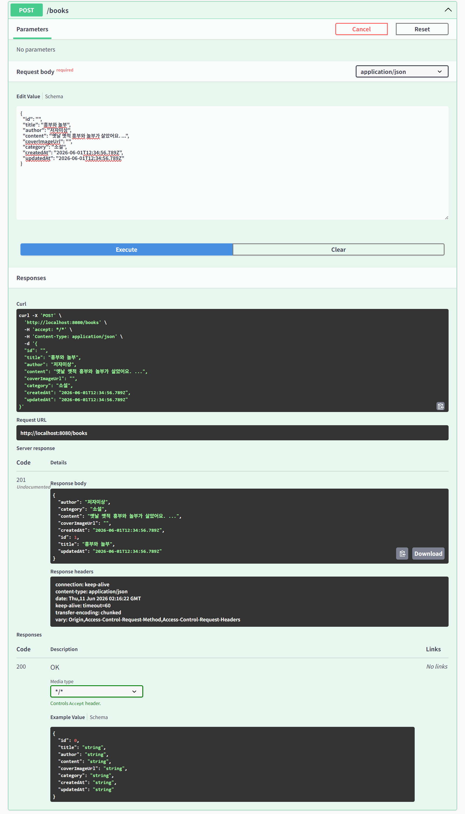

### 잘못된 요청 - 필수 필드 공란
#### Request

```http
POST /books
```

- content 공란
```json
{
  "id": "",
  "title": "흥부와 놀부",
  "author": "저자미상",
  "content": "",
  "coverImageUrl": "",
  "category": "소설",
  "createdAt": "2026-06-01T12:34:56.789Z",
  "updatedAt": "2026-06-01T12:34:56.789Z"
}
```

#### Response

```http
400 Bad Request
```

```json
{
  "status": 400,
  "message": "content: 공백일 수 없습니다"
}
```

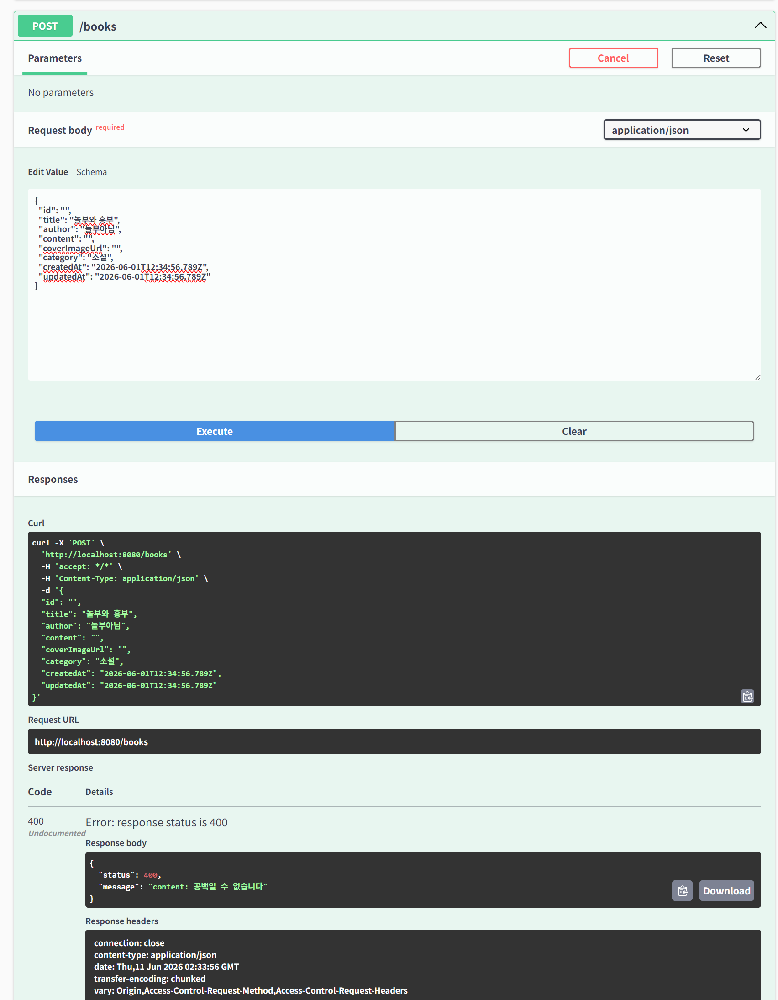

## 2. 도서 목록 조회

### Request

```http
GET /books
```

### Response

```http
200 OK
```

#### Response Body
```json
[
  {
    "author": "저자미상",
    "category": "소설",
    "content": "옛날 옛적 흥부와 놀부가 살았어요. ...",
    "coverImageUrl": "",
    "createdAt": "2026-06-01T12:34:56.789Z",
    "id": 1,
    "title": "흥부와 놀부",
    "updatedAt": "2026-06-01T12:34:56.789Z"
  },
  {
    "author": "놀부아님",
    "category": "소설",
    "content": "옛날 옛적 아주 멋진 놀부와 쫄딱 망한 흥부가 살고있었대, ...",
    "coverImageUrl": "",
    "createdAt": "2026-06-01T12:34:56.789Z",
    "id": 2,
    "title": "놀부와 흥부",
    "updatedAt": "2026-06-01T12:34:56.789Z"
  }
]
```

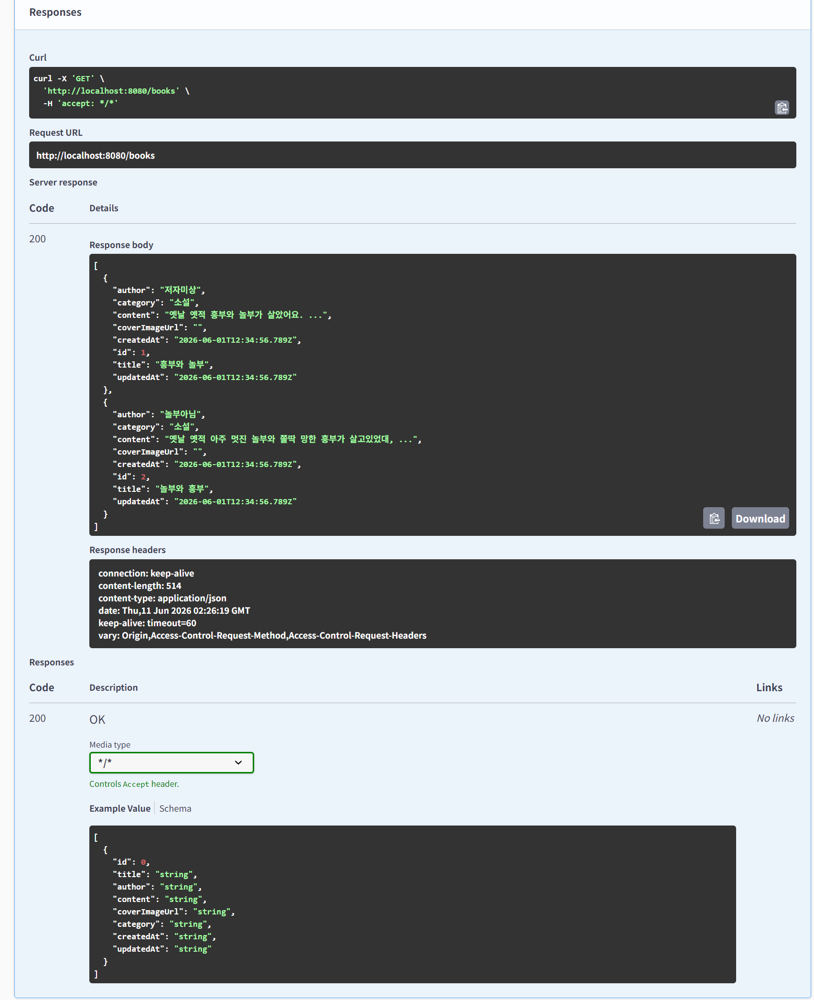

---

## 3. 도서 단건 조회

### Request

```http
GET /books/1
```

### Response

```http
200 OK
```

#### Response Body
```json
{
  "author": "저자미상",
  "category": "소설",
  "content": "옛날 옛적 흥부와 놀부가 살았어요. ...",
  "coverImageUrl": "",
  "createdAt": "2026-06-01T12:34:56.789Z",
  "id": 1,
  "title": "흥부와 놀부",
  "updatedAt": "2026-06-01T12:34:56.789Z"
}
```

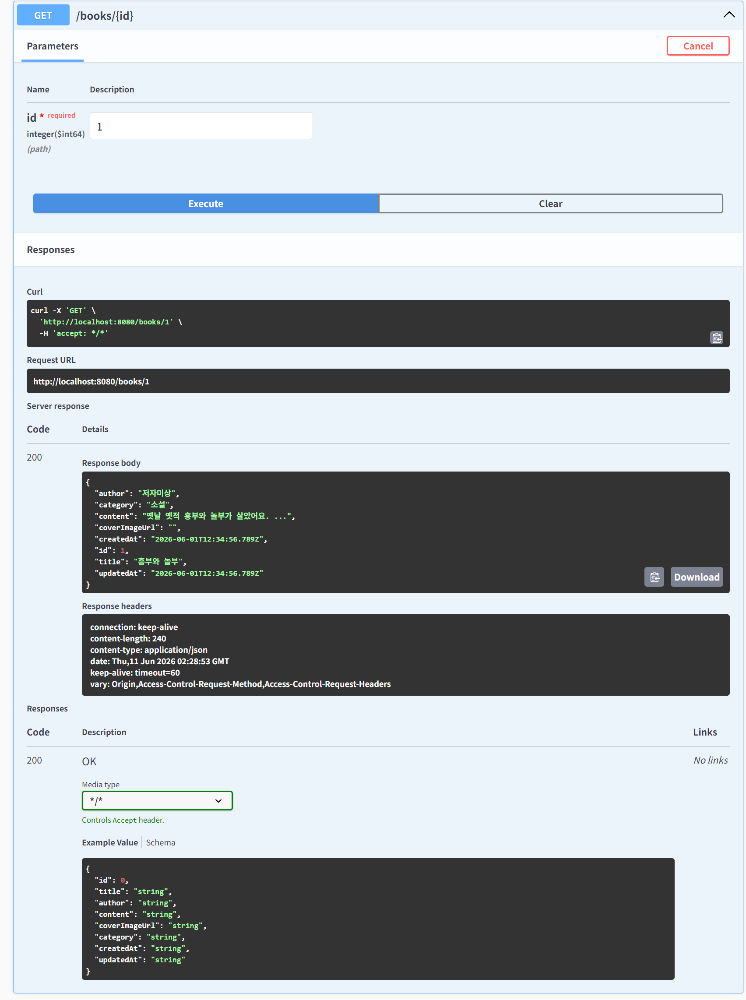

### 잘못된 요청 - id 유효하지 않음
#### Request
- 999번 도서 호출 (999번 도서 없음)
```http
GET /books/999
```

#### Response
```http
404 Not Found
```

```json
{
  "status": 404,
  "message": "Book not found with id: 999"
}
```

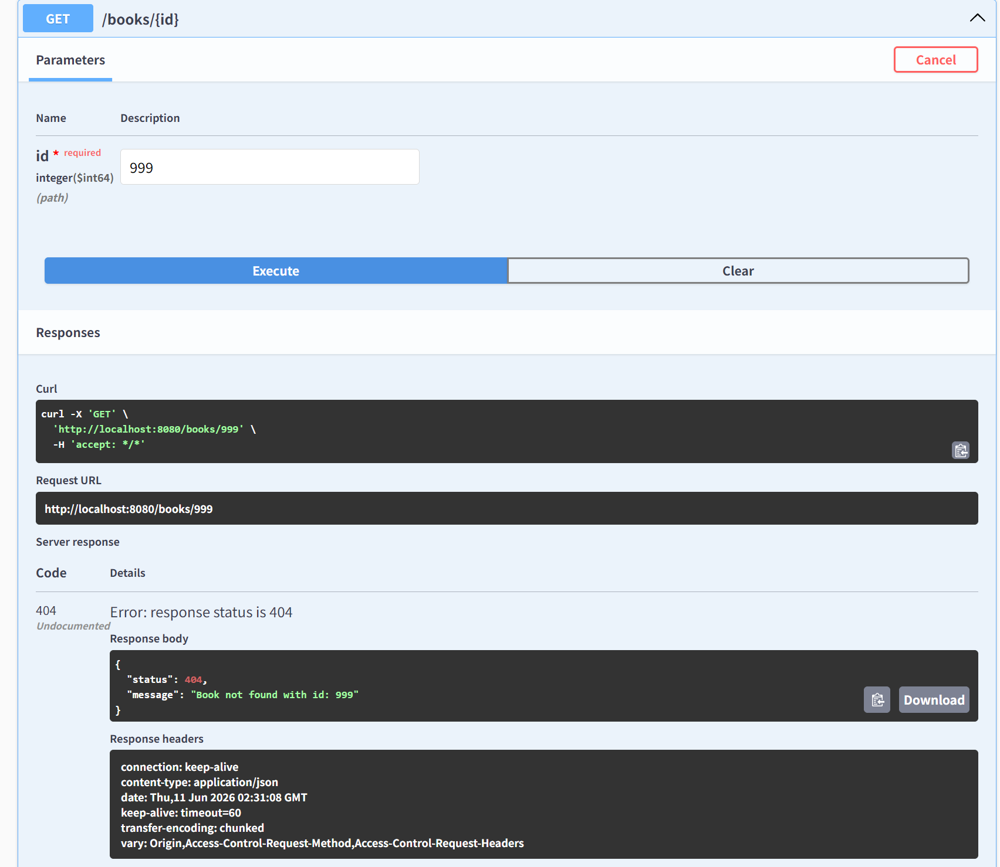

---

## 4. 도서 수정

### Request

```http
PUT /books/1
```

#### Request Body

```json
{
  "title": "클린 코드(개정판)",
  "author": "로버트 C. 마틴",
  "content": "애자일 소프트웨어 장인 정신 기술 서적의 개정판으로...",
  "coverImageUrl": "",
  "category": "IT/디지털",
  "createdAt": "2026-05-26T15:45:00.000Z",
  "updatedAt": "2026-05-26T15:45:00.000Z"
}
```

### Response

```http
200 OK
```

#### Response Body

```json
{
  "author": "로버트 C. 마틴",
  "category": "IT/디지털",
  "content": "애자일 소프트웨어 장인 정신 기술 서적의 개정판으로...",
  "coverImageUrl": "",
  "createdAt": "2026-06-01T12:34:56.789Z",
  "id": 1,
  "title": "클린 코드(개정판)",
  "updatedAt": "2026-05-26T15:45:00.000Z"
}
```

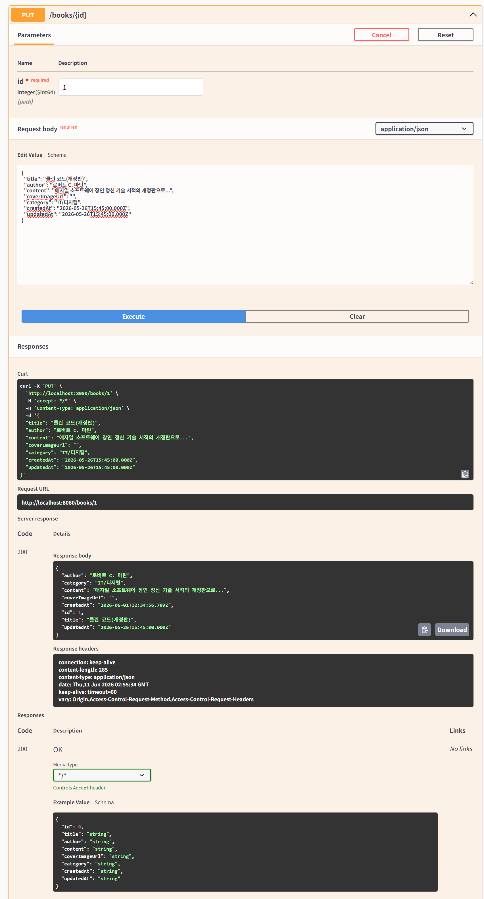

### 잘못된 요청 - id 유효하지 않음
#### Request
- 999번 도서 호출 (999번 도서 없음)
```http
PUT /books/999
```

#### Response

```http
404 Not Found
```

```json
{
  "status": 404,
  "message": "Book not found with id: 999"
}
```

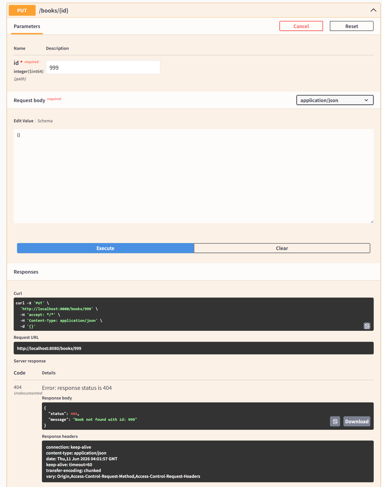

### 잘못된 요청 - 필수 필드 공란
#### Request
```http
PUT /books/1
```

```json
{
  "title": "클린 코드(개정판)",
  "author": "로버트 C. 마틴",
  "content": "",
  "coverImageUrl": "",
  "category": "IT/디지털",
  "createdAt": "2026-05-26T15:45:00.000Z",
  "updatedAt": "2026-05-26T15:45:00.000Z"
}
```

#### Response

```http
400 Bad Request
```

```json
{
  "status": 400,
  "message": "content: 공백일 수 없습니다"
}
```

이미지 추가 예정 (DTO적용 후)

---

## 5. 도서 삭제

### Request

```http
DELETE /books/1
```

### Response
```http
204 No Content
```

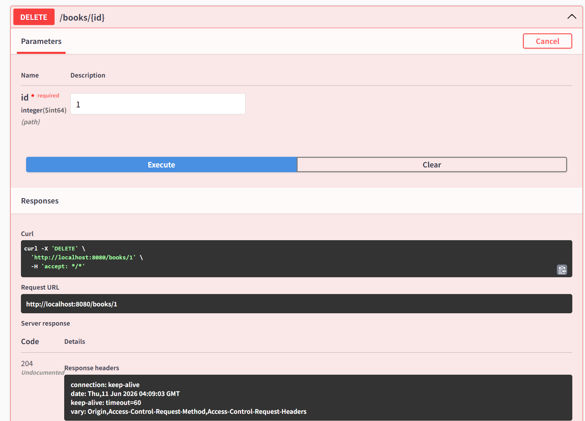

---

## 6. 도서 AI커버이미지 수정

TBD

---

## 7. 도서 부분수정

TBD

---

# 👥 Team R&R
## 운영 R&R
- 조장: 박지연
- 서기: 김종현
- 발표자: 김현성

## 기술 R&R
- PM: 김현성, 차태의
  - ERD / API 정의서, README.md 작성, 발표자료 준비, 통합 이슈 추적
- 백엔드 개발(1): 김민우
  - Book Entity 작성, BookRepository, H2 콘솔 확인, Lombok 4종 적용
- 백엔드 개발(2): 오채은
  - BookService 클래스, 비즈니스 로직, BookNotFoundException, `@Transactional`
- 백엔드 개발(3): 윤한아
  - BookController, 5종 CRUD 엔드포인트, `@Valid` + `@NotBlank`, Postman 테스트
- 통합 / 예외처리: 김종현
  - WebConfig(CORS), GlobalExceptionHandler, 풀스택 디버깅, 트러블슈팅 정리
- AI / Frontend 연동: 박지연
  - Frontend 코드 분석, fetch URL 변경 / 1차 연동, OpenAI 표지 흐름, E2E 시연 준비


# 📚 Frontend-Backend 연동

---

## 🟡 도서 등록

**POST /books**


---

## 🟢 도서 목록 조회

**GET /books**

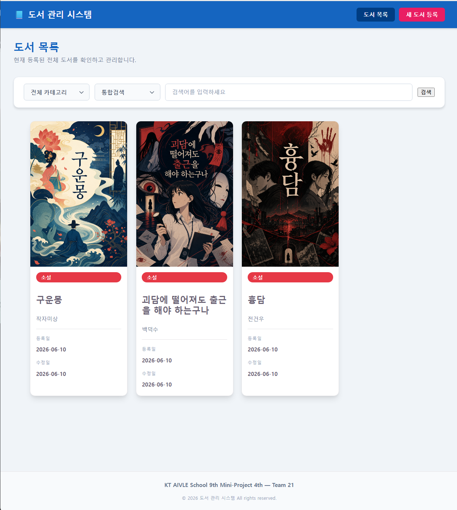

---

## 🟢 도서 상세 조회

**GET /books/{id}**

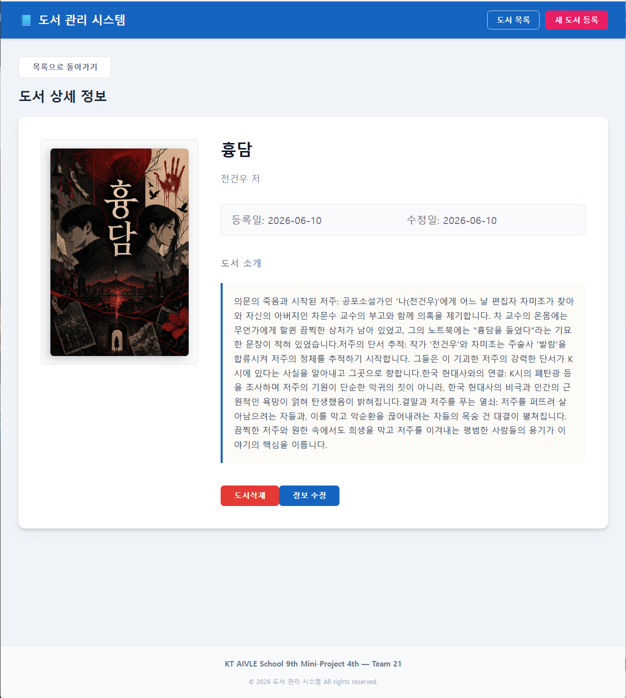

---

## 🔵 도서 수정

**PUT /api/books/{id}**

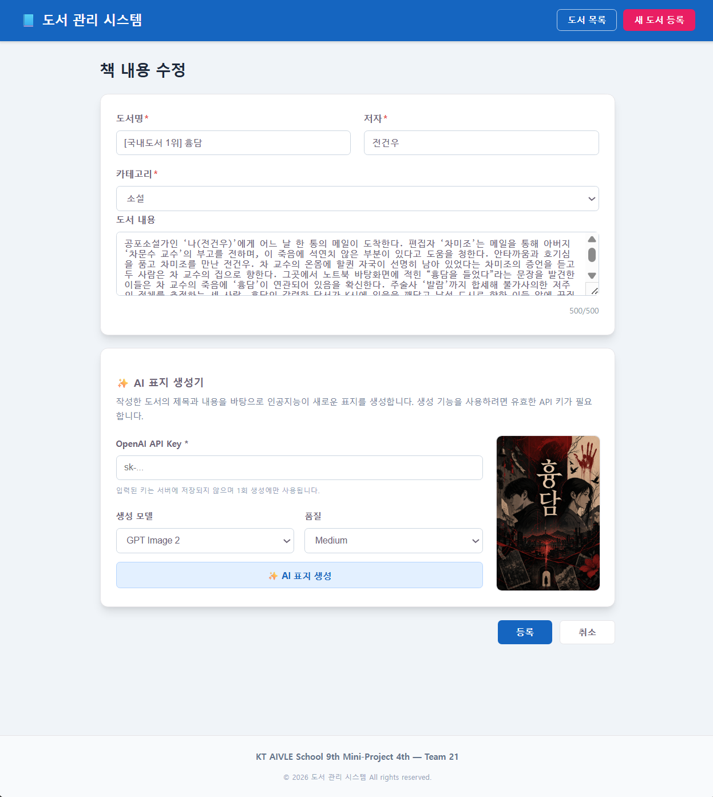

GET /books/{id} (수정 후 상세)
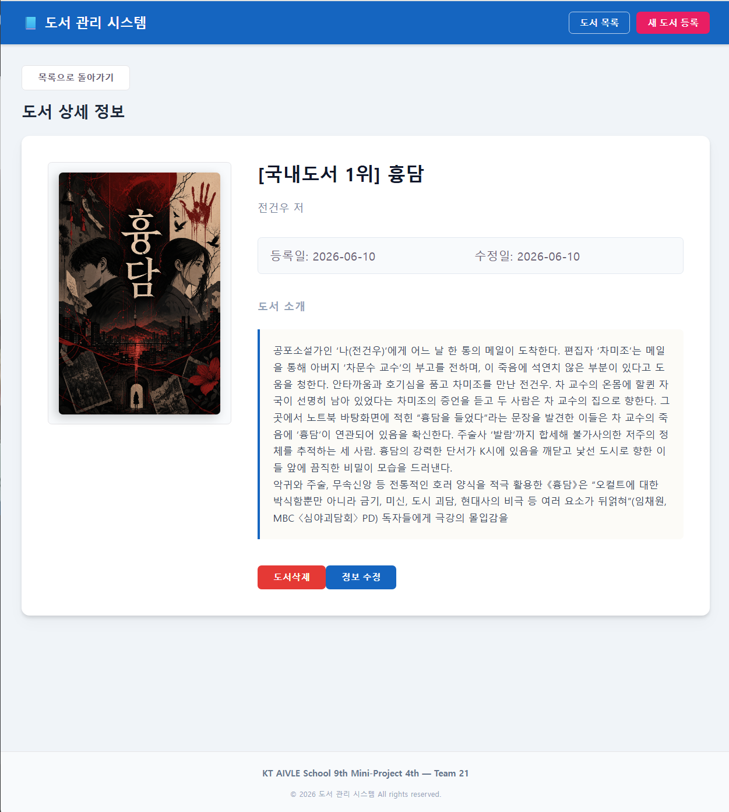

---

## 🔴 도서 삭제

**DELETE /api/books/{id}**
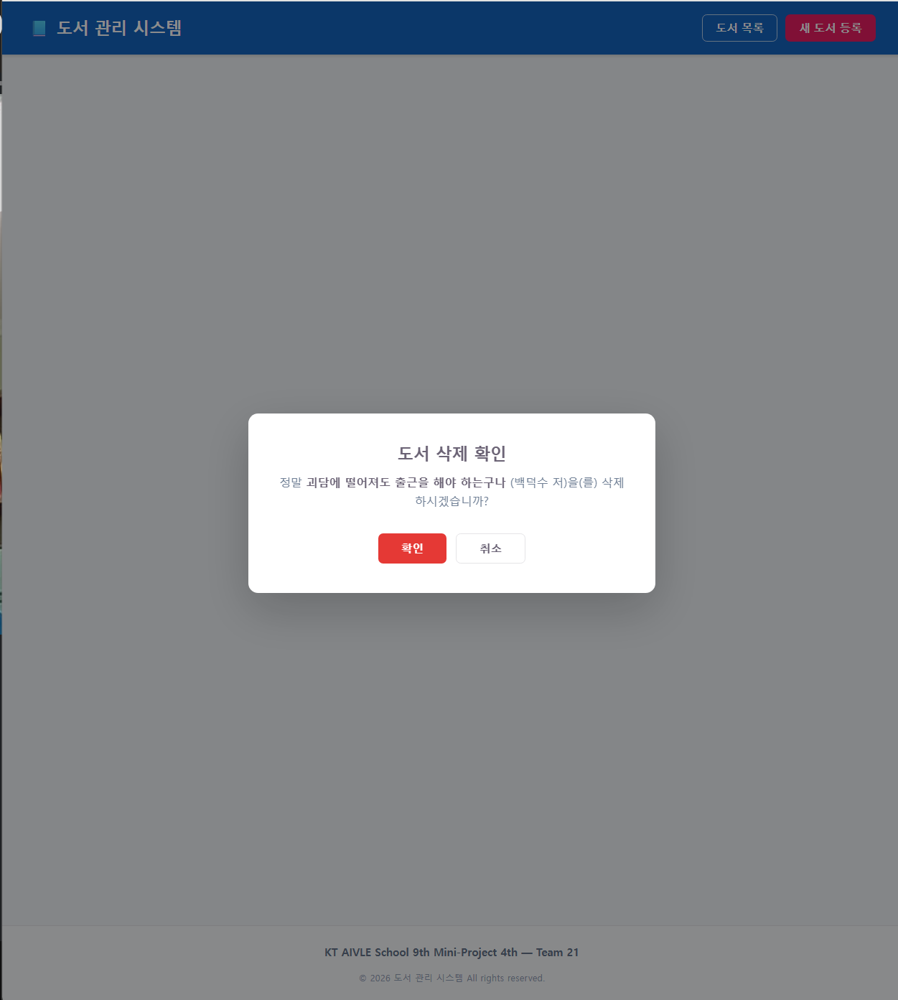

GET /books (삭제 후 도서 조회)
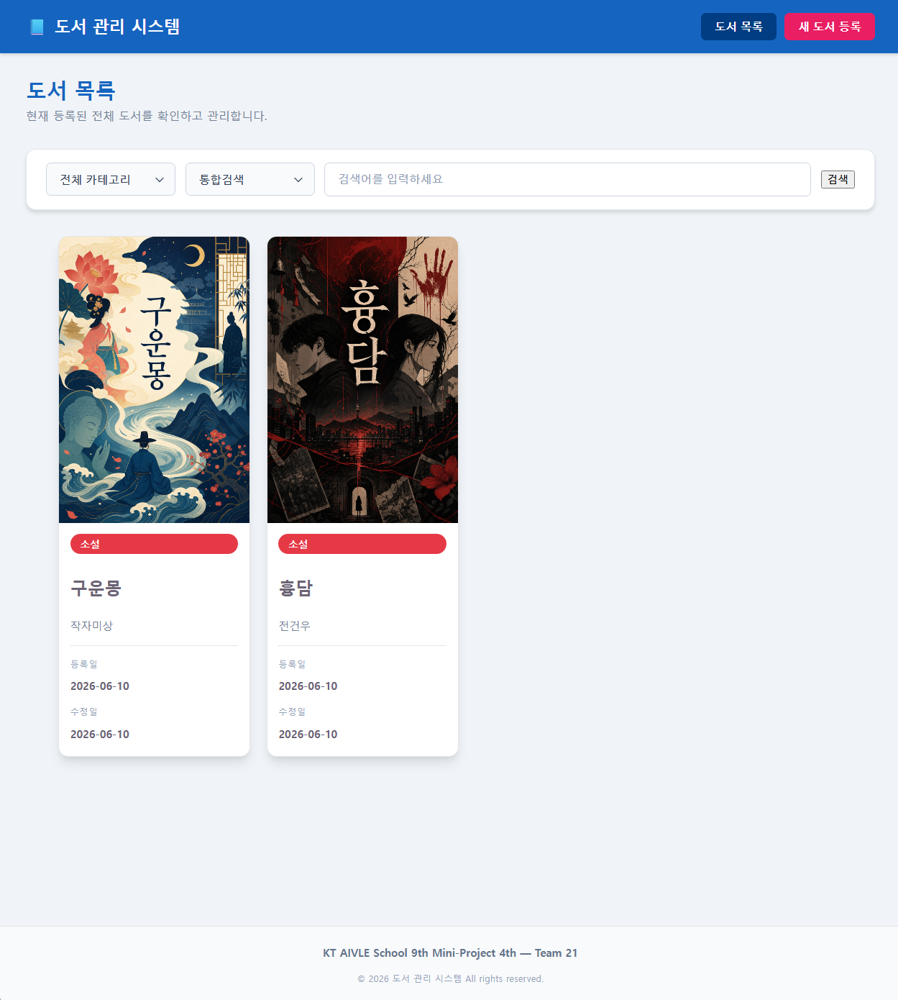

---

## 프론트-백엔드 연동 흐름

1. 사용자가 도서 등록 화면 입력
2. Frontend에서 API 요청
3. Backend에서 데이터 저장
4. DB 저장 완료
5. 결과 반환
6. Frontend 화면 갱신

---

